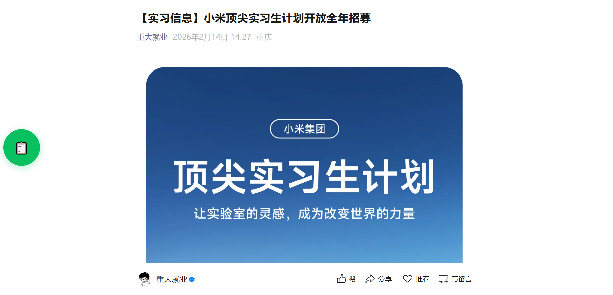
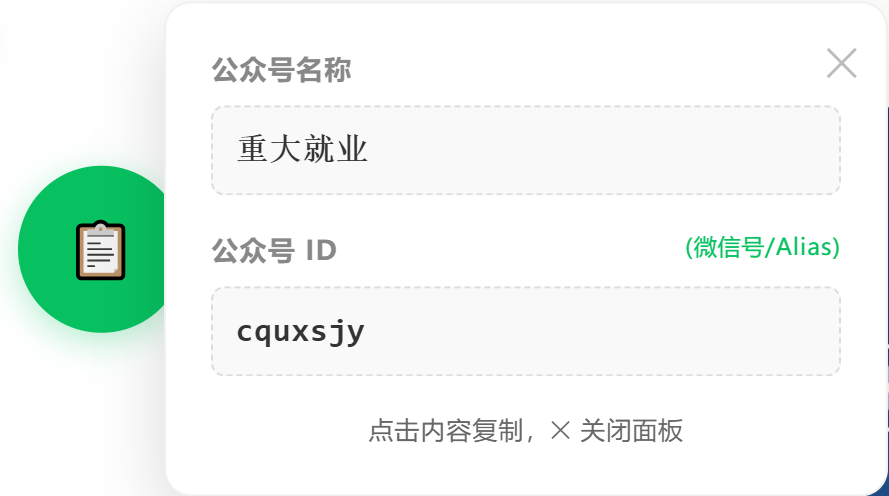

# 🛠️ 微信公众号信息提取工具

### 🌟 开发背景
针对公众号文章末尾 **【转载声明】** 中公众号名称与ID均需手动输入、无工具辅助的痛点，特开发此工具，以降低操作复杂度、提升工作效率。

---

### 📥 第一阶段：环境准备
在安装脚本前，请确保您的浏览器已安装用户脚本管理器扩展（插件）。

1.  **推荐插件**：
    * [**篡改猴 (Tampermonkey)**](https://www.tampermonkey.net/)：最为流行，功能强大 。
    * [**暴力猴 (Violentmonkey)**](https://violentmonkey.github.io/)：开源轻量，操作简洁。
2.  **获取方式**：在 Chrome、Edge 或 Firefox 的扩展商店搜索名称并添加即可。

---

### 🚀 第二阶段：部署脚本

#### 步骤说明：
1.  点击浏览器右上角 **脚本管理器图标**（如篡改猴）-> 选择 **“添加新脚本”**。
2.  在弹出的代码编辑器中，**删除所有已有内容**。
3.  将下方代码框内的代码完整粘贴进去，并点击 **文件 -> 保存** (或按 `Ctrl + S`)。

#### 脚本代码：
```javascript
// ==UserScript==
// @name         微信公众号信息提取器
// @namespace    http://tampermonkey.net/
// @version      1.2
// @description  一个简单好用的微信公众号信息提取器
// @author       CQU_major
// @match        https://mp.weixin.qq.com/s/*
// @match        https://mp.weixin.qq.com/s?*
// @grant        GM_setClipboard
// @grant        GM_addStyle
// ==/UserScript==

(function() {
    'use strict';

    // 1. 样式注入
    GM_addStyle(`
        #wx-extractor-btn {
            position: fixed;
            left: 20px;
            top: 50%;
            transform: translateY(-50%);
            z-index: 9999;
            background: #07c160;
            color: white;
            padding: 12px;
            border-radius: 50%;
            cursor: pointer;
            box-shadow: 0 4px 15px rgba(7,193,96,0.3);
            font-size: 24px;
            width: 50px;
            height: 50px;
            display: flex;
            align-items: center;
            justify-content: center;
            transition: all 0.3s cubic-bezier(0.175, 0.885, 0.32, 1.275);
        }
        #wx-extractor-btn:hover { background: #06ad56; transform: translateY(-50%) scale(1.1); }

        #wx-res-card {
            position: fixed;
            left: 85px;
            top: 50%;
            transform: translateY(-50%);
            z-index: 9999;
            background: white;
            padding: 20px;
            border-radius: 12px;
            box-shadow: 0 10px 30px rgba(0,0,0,0.15);
            width: 280px;
            display: none;
            border: 1px solid #f0f0f0;
            animation: fadeIn 0.3s ease;
        }
        @keyframes fadeIn { from { opacity: 0; transform: translateY(-45%); } to { opacity: 1; transform: translateY(-50%); } }

        .wx-res-item { margin-bottom: 15px; }
        .wx-res-label { font-size: 12px; color: #888; margin-bottom: 6px; font-weight: bold; }
        .wx-res-value {
            font-size: 14px;
            font-weight: 600;
            color: #333;
            font-family: 'SF Mono', Consolas, monospace;
            background: #f9f9f9;
            padding: 8px 10px;
            border-radius: 6px;
            word-break: break-all;
            cursor: pointer;
            border: 1px dashed #ddd;
        }
        .wx-res-value:hover { color: #07c160; border-color: #07c160; background: #f0fdf4; }
        .wx-id-type { font-size: 10px; color: #07c160; float: right; font-weight: normal; }
        .wx-close { position: absolute; right: 12px; top: 12px; cursor: pointer; color: #bbb; font-size: 18px; }
    `);

    // 2. 结构创建
    const btn = document.createElement('div');
    btn.id = 'wx-extractor-btn';
    btn.innerHTML = '📋';
    document.body.appendChild(btn);

    const card = document.createElement('div');
    card.id = 'wx-res-card';
    card.innerHTML = `
        <div class="wx-close">✕</div>
        <div class="wx-res-item">
            <div class="wx-res-label">公众号名称</div>
            <div id="val-nick" class="wx-res-value">提取中...</div>
        </div>
        <div class="wx-res-item">
            <div class="wx-res-label">
                公众号 ID <span id="id-type" class="wx-id-type"></span>
            </div>
            <div id="val-id" class="wx-res-value">提取中...</div>
        </div>
        <div style="font-size:11px; color:#666; text-align:center;">点击内容复制，✕ 关闭面板</div>
    `;
    document.body.appendChild(card);

    // 3. 核心逻辑
    btn.onclick = () => {
        const data = window.cgiDataNew || {};
        const html = document.documentElement.innerHTML;

        // 辅助提取函数：先从变量找，再从正则找
        const getVal = (key) => {
            if (data[key]) return data[key];
            const reg = new RegExp(`${key}\\s*:\\s*JsDecode\\(['"](.*?)['"]\\)`);
            const match = html.match(reg);
            return match ? match[1] : null;
        };

        const nick = getVal('nick_name') || '未找到';
        const alias = getVal('alias');
        const userName = getVal('user_name');

        let finalID = '';
        let typeText = '';

        // 判断逻辑：如果 alias 存在且不为空字符串，则使用 alias；否则使用 user_name
        if (alias && alias.trim() !== "") {
            finalID = alias;
            typeText = "(微信号/Alias)";
        } else {
            finalID = userName || '未找到';
            typeText = "(原始ID/Username)";
        }

        document.getElementById('val-nick').innerText = nick;
        document.getElementById('val-id').innerText = finalID;
        document.getElementById('id-type').innerText = typeText;

        card.style.display = 'block';
    };

    // 4. 复制功能
    const setupCopy = (id) => {
        const el = document.getElementById(id);
        el.onclick = () => {
            const text = el.innerText;
            if (text.includes('中') || text === '未找到') return;
            GM_setClipboard(text);
            const originalText = el.innerText;
            el.innerText = '✅ 已复制';
            setTimeout(() => el.innerText = originalText, 800);
        };
    };

    setupCopy('val-nick');
    setupCopy('val-id');
    document.querySelector('.wx-close').onclick = () => card.style.display = 'none';

})();

```

### 📖 第三阶段：如何使用

安装完成后，只需简单三步即可高效获取数据：

#### **第一步：访问文章**
打开任意一篇微信公众号文章，确保浏览器地址栏以 `mp.weixin.qq.com/s...` 开头。

#### **第二步：点击图标**
进入页面后，你会发现页面左侧中央多了一个绿色的 **悬浮按钮**。点击该按钮即可激活提取面板。



#### **第三步：提取与复制**
页面将弹出信息卡片，展示以下内容：
* **公众号名称**：自动识别当前的号主名称。
* **公众号 ID**：工具具备智能判断逻辑，会**优先显示 alias（自定义微信号）**；若该号未设置微信号，则自动切换显示 **user_name（原始 gh_ 开头的 ID）**。
* **一键复制**：无需手动选中文本，直接点击卡片上的绿色或灰色文字区域，内容会自动复制到你的剪贴板，并弹出“已复制”提示。



---
**💡 小技巧**：配合浏览器快捷键 `Ctrl + V`，您可以快速将提取到的信息粘贴至转载声明录入框中。


