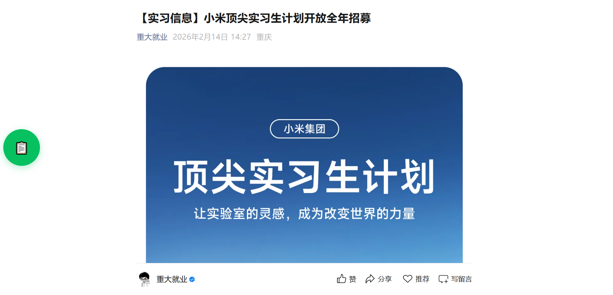
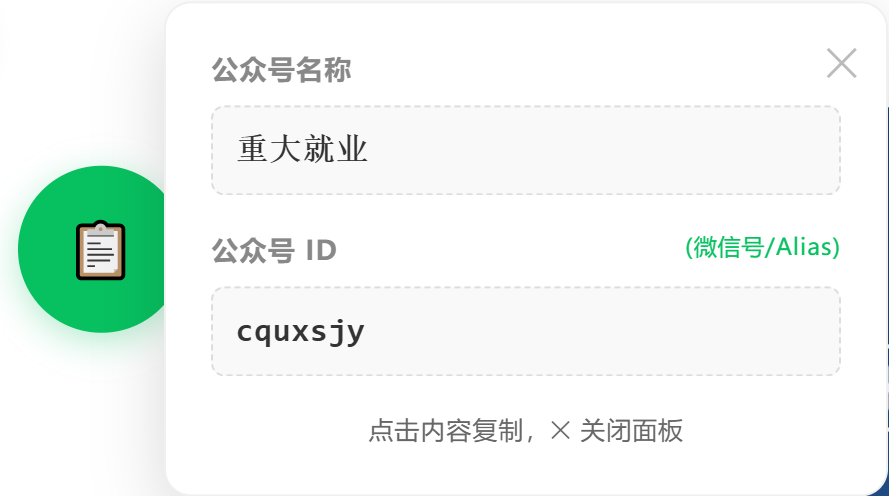

# 🛠️ 微信公众号信息提取工具

### 🌟 开发背景
针对公众号文章末尾 **【转载声明】** 中公众号名称与ID均需手动输入、无工具辅助的痛点，特开发此工具，以降低操作复杂度、提升工作效率。

---

### 📥 第一阶段：环境准备
在安装脚本前，请确保您的浏览器已安装用户脚本管理器扩展（插件）。

1.  **推荐插件**：
    * [**篡改猴 (Tampermonkey)**](https://www.tampermonkey.net/)：最为流行，功能强大 。
    * [**暴力猴 (Violentmonkey)**](https://violentmonkey.github.io/)：开源轻量，操作简洁。
2.  **获取方式**：在 Chrome、Edge 或 Firefox 的扩展商店搜索名称并添加即可。

---

### 🚀 第二阶段：部署脚本

#### 步骤说明：
1.  点击浏览器右上角 **脚本管理器图标**（如篡改猴）-> 选择 **“添加新脚本”**。
2.  在弹出的代码编辑器中，**删除所有已有内容**。
3.  将下方代码框内的代码完整粘贴进去，并点击 **文件 -> 保存** (或按 `Ctrl + S`)。

#### 脚本代码：
```javascript
// ==UserScript==
// @name         微信公众号信息提取器
// @namespace    http://tampermonkey.net/
// @version      1.3
// @description  一个简单好用的微信公众号信息提取器（适配 2026 新版页面格式，明文 alias/user_name/nick_name 字段）
// @author       CQU_major
// @match        https://mp.weixin.qq.com/s/*
// @match        https://mp.weixin.qq.com/s?*
// @grant        GM_setClipboard
// @grant        GM_addStyle
// @grant        unsafeWindow
// ==/UserScript==

(function() {
    'use strict';

    // 1. 样式注入
    GM_addStyle(`
        #wx-tool-btn {
            position: fixed; left: 20px; top: 50%; transform: translateY(-50%);
            z-index: 9999; background: #07c160; color: white; padding: 12px;
            border-radius: 50%; cursor: pointer; box-shadow: 0 4px 15px rgba(7,193,96,0.3);
            font-size: 24px; width: 50px; height: 50px; display: flex;
            align-items: center; justify-content: center; transition: 0.3s;
        }
        #wx-tool-btn:hover { transform: translateY(-50%) scale(1.1); background: #06ad56; }
        #wx-info-card {
            position: fixed; left: 85px; top: 50%; transform: translateY(-50%);
            z-index: 9999; background: white; padding: 20px; border-radius: 12px;
            box-shadow: 0 10px 30px rgba(0,0,0,0.15); width: 280px; display: none;
            border: 1px solid #f0f0f0;
        }
        .info-item { margin-bottom: 15px; }
        .info-label { font-size: 12px; color: #888; margin-bottom: 5px; font-weight: bold; }
        .info-value {
            font-size: 14px; font-weight: 600; color: #333; background: #f9f9f9;
            padding: 8px; border-radius: 6px; cursor: pointer; border: 1px dashed #ddd;
            transition: 0.2s; min-height: 20px;
        }
        .info-value:hover { color: #07c160; border-color: #07c160; background: #f0fdf4; }
        .id-type-tag { font-size: 10px; color: #07c160; float: right; font-weight: normal; }

        .close-x { position: absolute; right: 12px; top: 12px; cursor: pointer; color: #bbb; font-size: 18px; }
        .close-x:hover { color: #666; }
    `);

    // 2. 创建UI
    const btn = document.createElement('div');
    btn.id = 'wx-tool-btn';
    btn.innerHTML = '📋';
    document.body.appendChild(btn);

    const card = document.createElement('div');
    card.id = 'wx-info-card';
    card.innerHTML = `
        <div class="close-x">✕</div>
        <div class="info-item">
            <div class="info-label">公众号名称</div>
            <div id="out-nick" class="info-value">提取中...</div>
        </div>
        <div class="info-item">
            <div class="info-label">
                公众号 ID <span id="id-type-label" class="id-type-tag"></span>
            </div>
            <div id="out-id" class="info-value">提取中...</div>
        </div>
        <div style="font-size:11px; color:#999; text-align:center;">点击内容直接复制，✕关闭面板</div>
    `;
    document.body.appendChild(card);

    // 3. 核心提取逻辑
    btn.onclick = () => {
        // 兼容 Tampermonkey 沙箱：优先 unsafeWindow，回退到 window
        const win = (typeof unsafeWindow !== 'undefined') ? unsafeWindow : window;
        const data = win.cgiDataNew || window.cgiDataNew || {};
        const html = document.documentElement.innerHTML;

        const getV = (k) => {
            // 1) 直接从 window.cgiDataNew 对象读取（最可靠）
            if (data[k]) return String(data[k]);

            // 2) 新版明文格式：key: 'value' 或 key: "value"
            //    支持 \x3c 之类的转义字符（cgiDataNew 里 content_noencode 用的就是这种）
            //    使用反向引用 \1 保证开闭引号一致
            const plainReg = new RegExp(`${k}\\s*:\\s*(['"])((?:[^'"\\\\]|\\\\.)*?)\\1`);
            const plainMatch = html.match(plainReg);
            if (plainMatch && plainMatch[2]) return plainMatch[2];

            // 3) 旧版 JsDecode 格式：key: JsDecode('value')（向后兼容）
            const reg = new RegExp(`${k}\\s*:\\s*JsDecode\\(['"](.*?)['"]\\)`);
            const match = html.match(reg);
            return match ? match[1] : null;
        };

        // --- 名称提取 (双重识别逻辑) ---
        let nick = getV('nick_name');
        if (!nick || nick === '无法识别') {
            const el = document.querySelector('#profileMetatData strong.profile_nickname') ||
                       document.querySelector('.profile_nickname') ||
                       document.querySelector('#js_name');
            nick = el ? el.innerText.trim() : '无法识别';
        }

        // --- ID 提取与类型判断 ---
        const alias = getV('alias');
        const user = getV('user_name');

        let finalID = '';
        let typeText = '';

        if (alias && alias.trim() !== "") {
            finalID = alias;
            typeText = "（微信号/Alias）";
        } else {
            finalID = user || '未找到ID';
            typeText = "（微信号/Username）";
        }

        document.getElementById('out-nick').innerText = nick;
        document.getElementById('out-id').innerText = finalID;
        document.getElementById('id-type-label').innerText = typeText;
        card.style.display = 'block';
    };

    // 4. 复制逻辑
    const setupCopy = (id) => {
        const el = document.getElementById(id);
        el.onclick = () => {
            const text = el.innerText;
            if (text.includes('提取中') || text === '未找到ID') return;
            GM_setClipboard(text);
            el.innerText = '✅ 已复制';
            setTimeout(() => el.innerText = text, 800);
        };
    };

    setupCopy('out-nick');
    setupCopy('out-id');
    card.querySelector('.close-x').onclick = () => card.style.display = 'none';
})();

```

### 📖 第三阶段：如何使用

安装完成后，只需简单三步即可高效获取数据：

#### **第一步：访问文章**
打开任意一篇微信公众号文章，确保浏览器地址栏以 `mp.weixin.qq.com/s...` 开头。

#### **第二步：点击图标**
进入页面后，你会发现页面左侧中央多了一个绿色的 **悬浮按钮**。点击该按钮即可激活提取面板。



#### **第三步：提取与复制**
页面将弹出信息卡片，展示以下内容：
* **公众号名称**：自动识别当前的号主名称。
* **公众号 ID**：工具具备智能判断逻辑，会**优先显示 alias（自定义微信号）**；若该号未设置微信号，则自动切换显示 **user_name（原始 gh_ 开头的 ID）**。
* **一键复制**：无需手动选中文本，直接点击卡片上的绿色或灰色文字区域，内容会自动复制到你的剪贴板，并弹出“已复制”提示。



---
**💡 小技巧**：配合浏览器快捷键 `Ctrl + V`，您可以快速将提取到的信息粘贴至转载声明录入框中。


